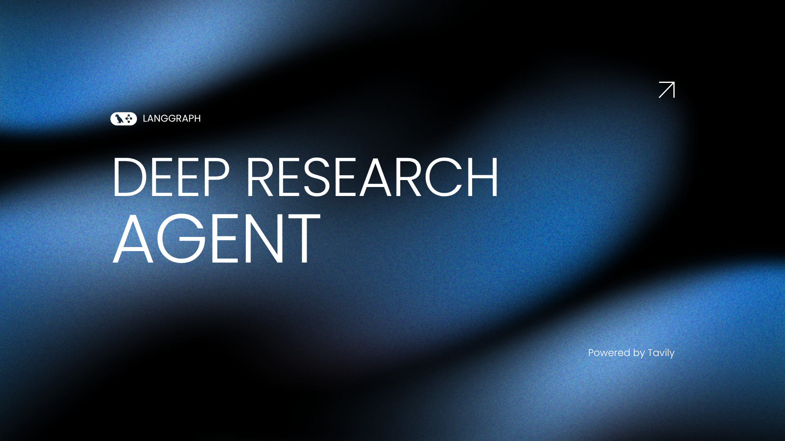
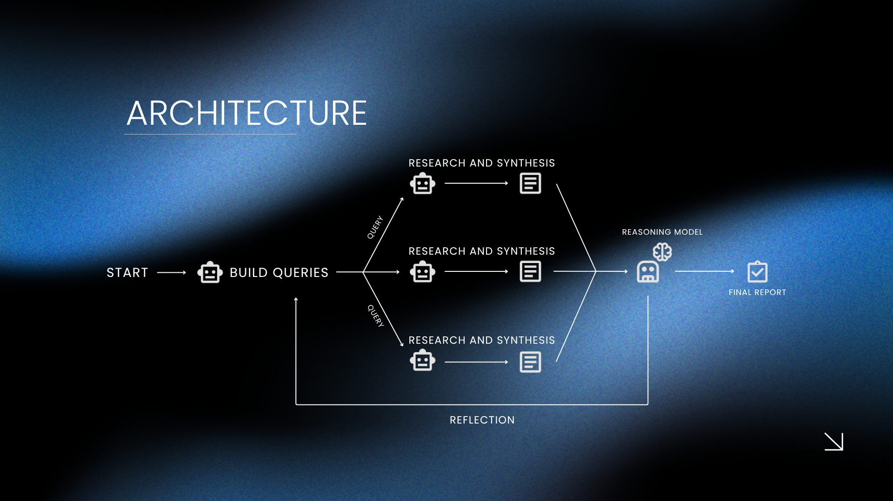
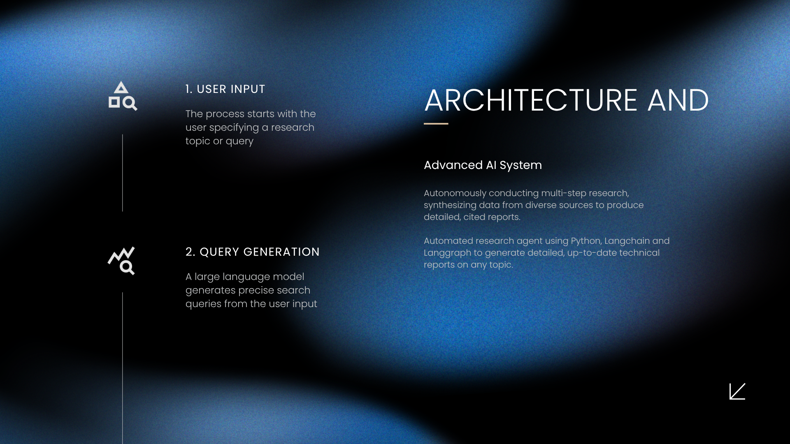
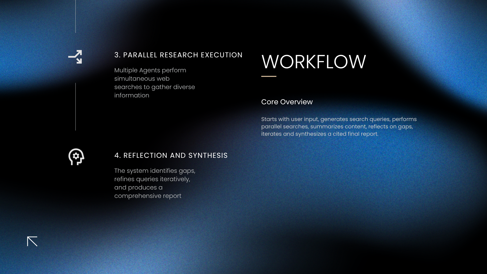

### **OVERVIEW**

The Deep Research Agent is an advanced autonomous system designed to perform comprehensive, multi-step research tasks. It leverages large language models, web search APIs, and a multi-agent orchestration framework to decompose complex queries, conduct parallel research, synthesize findings, and iteratively refine knowledge through reflection and reasoning.

A Deep Research Agent is an AI-driven system capable of autonomously planning, executing, and synthesizing research on arbitrary topics. It mimics the workflow of a human researcher by breaking down questions, searching for information, evaluating sources, and iteratively improving its understanding. The agent is particularly suited for technical analysis, literature reviews, and knowledge discovery.

---

### **ARCHITECTURE**

#### 1. Research Planning

The workflow begins with a planning agent that interprets the user's input and generates a set of targeted search queries. This agent uses prompt engineering and LLMs to ensure that the queries are relevant and comprehensive.

#### 2. Multi-Agent Spawning

For each generated query, the system spawns independent researcher agents. These agents operate in parallel, each responsible for investigating a specific aspect of the research topic. This parallelism increases both the speed and breadth of information gathering.

#### 3. Web Search and Summarization

Each researcher agent utilizes web search APIs to retrieve up-to-date information. The raw search results are then summarized using LLMs, ensuring that only the most relevant and useful data is retained for further processing.

#### 4. Reflection and Iterative Reasoning

After the initial research cycle, a reflection agent evaluates the synthesized knowledge. Using a reasoning LLM, it identifies knowledge gaps, formulates follow-up queries, and can trigger additional research cycles. This iterative process allows the agent to deepen its understanding and address any missing information.

#### 5. Synthesis and Reporting

Once the research and reflection cycles are complete, a synthesis agent aggregates all findings into a structured, multi-paragraph technical report. The report includes reference citations for traceability and is designed to be both comprehensive and technically rigorous.

---

### **LIKE THE PROJECT**

If you find this project useful, consider giving it a ★ **star** on GitHub — it really helps with visibility and community support!

---

### **AUTHOR**

Giovane Iwamoto - Computer Science - AI Engineer

I am always open to receiving constructive criticism and suggestions for improvement in my developed code. I believe that feedback is an essential part of the learning and growth process, and I am eager to learn from others and make my code the best it can be. Whether it's a minor tweak or a major overhaul, I am willing to consider all suggestions and implement the changes that will benefit my code and its users.

---

### **REFERENCES**

https://blog.langchain.com/open-deep-research/

https://cognition.ai/blog/dont-build-multi-agents

https://www.anthropic.com/engineering/built-multi-agent-research-system?

https://openai.com/index/browsecomp/

https://cognition.ai/blog/dont-build-multi-agents#a-theory-of-building-long-running-agents

https://blog.langchain.com/context-engineering-for-agents/